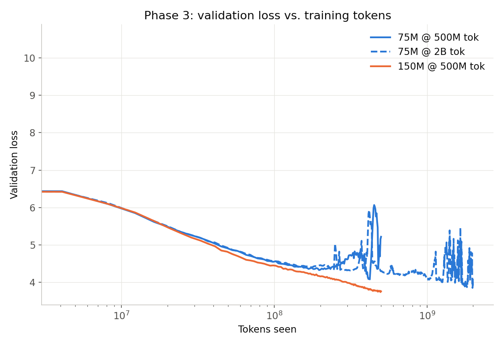
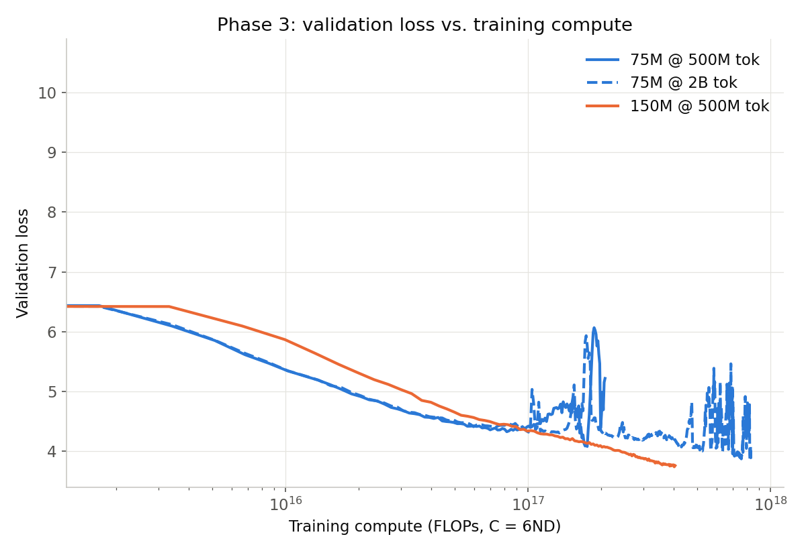

# Phase 3 Results

## What was run

3 training runs, per `docs/phase3/sprint-plan.md`'s trimmed design — same architecture as Phases 1-2, full ~9.14B-token OpenWebText corpus (re-tokenized with the 32K BPE tokenizer, see `data/phase2/prepare_full.py`).

| Run | Model | Actual params | Tokens | Tokens/param | Final val loss |
|---|---|---|---|---|---|
| 1 | 75M config (8L/8H/576E) | 69.4M | 500M | ~7.2x | **5.2171** |
| 2 | 75M config (8L/8H/576E) | 69.4M | 2B | ~28.8x | **3.8972** |
| 3 | 150M config (12L/12H/768E) | 135.0M | 500M | ~3.7x | **3.7578** |

## Loss vs. tokens seen

## Loss vs. training compute

## Two comparisons this design was built for

- **Run 1 vs Run 2** — same model (75M), 4x the tokens. Tests whether more data helps at fixed size.
- **Run 1 vs Run 3** — same tokens (500M), ~1.9x the parameters. Tests whether more parameters help at fixed, scarce data — the same comparison Phase 1 ran at a smaller scale (50M vs 77M, both at ~80M tokens).

Reading what these two comparisons actually show — and why Run 3's result here doesn't match Phase 1's pattern — is the analysis step that's yours to do, per this project's own rules on scaling-law interpretation.

## A data artifact worth knowing about

Run 2 (75M @ 2B tokens) has a real loss spike around iter 50,000-53,000 (tokens ≈ 4.1-4.3×10^8) — val loss jumped from ~4.4 to ~5.9 over a few hundred iterations, then recovered on its own by iter 53,500 and continued its downward trend normally. No checkpoint resume happened at that point (no resume message in the log) — it's a genuine training instability that self-corrected. Worth keeping in mind if you're fitting a smooth curve through this run's data; the spike is a real transient, not noise to average away without noting it.

## Process notes

- A real bug was found and fixed in `model.py`'s `configure_optimizers` (a Python `set` instead of `list` caused non-deterministic parameter ordering that broke checkpoint-resume) — fixed and verified before these runs.
- These plots read straight from the training logs (`logs/phase3_*.log`), not hand-copied numbers — see `docs/phase3/plot_results.py`.

## Next

Phase 4 — knowledge distillation. Run 1 vs Run 3's result is one relevant input into picking the student model's size.
